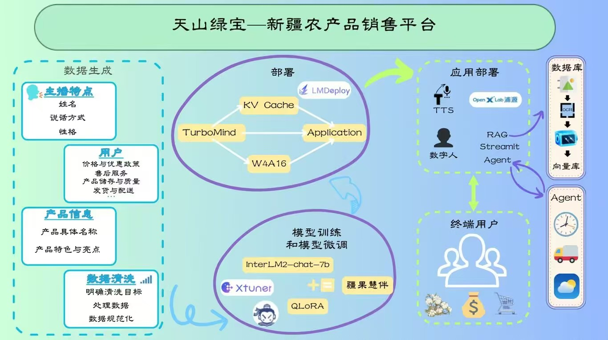

<!-- for modelscope yaml info
---
language:
- zh
tags:
- streamer-sales
- internlm2
frameworks:
- pytorch
tasks:
- text-generation
license: Apache License 2.0
---
-->
# 天山绿宝-新疆农产品销售平台


## 📢 项目介绍

**天山绿宝-新疆农产品销售平台** 是一个以大模型技术为支撑，致力于推广和销售新疆特色农产品的电子商务平台。本项目旨在通过线上线下相结合的方式，打破地域限制，将新疆优质农产品推向全国乃至全球市场，实现农民增收、农业产业升级和乡村振兴，促进新疆地区的经济发展。

模型用 [xtuner](https://github.com/InternLM/xtuner) 在 [InternLM2](https://github.com/InternLM/InternLM) 的基础上指令微调而来，部署集成了 LMDeploy **加速推理**🚀，支持 **TTS文字转语音** 🎙️，支持 **RAG 检索增强生成**📚做到可以随时更新说明书指导主播生成文案，支持 **Agent 通过网络查询快递，时间，天气信息** 🌐，最后还会**生成主播数字人视频**🦸，让主播不止于文字介绍。

**功能点总结：**

- 🍇 新疆特色农产品销售
- 🚀 助力新疆的经济发展
- 🤖 数字人主播-疆果慧伴
- 💡 AI智能客服-解决您的疑惑
- 🗣️ TTS 文字转语音
- 🌐 Agent 使用网络查询天气、物流等信息

## 📌 目录

- [天山绿宝-新疆农产品销售平台](#天山绿宝-新疆农产品销售平台)
  - [📢 介绍](#-介绍)
  - [📌 目录](#-目录)
  - [🛠 架构图](#-架构图)
  - [📺️ 讲解视频](#️-讲解视频)
  - [💕 致谢](#-致谢)
  - [🔗 引用](#-引用)


## 🛠 架构图




## 📺️ 讲解视频
(【希望大家喜欢我们的项目，一键三连，多多支持哦！】https://www.bilibili.com/video/BV1wYk7YYECW?vd_source=79043acbf72d00fde9be03c84a5c5539)


## 💕 致谢

- [InternLM](https://github.com/InternLM/InternLM)
- [xtuner](https://github.com/InternLM/xtuner)
- [LMDeploy](https://github.com/InternLM/LMDeploy)
- [HuixiangDou](https://github.com/InternLM/HuixiangDou)
- [GPT-SoVITS](https://github.com/RVC-Boss/GPT-SoVITS)
- [MuseTalk](https://github.com/TMElyralab/MuseTalk)
- [lagent](https://github.com/InternLM/lagent)
- [FunASR](https://github.com/modelscope/FunASR)

感谢上海人工智能实验室推出的书生·浦语大模型实战营，为我们的项目提供宝贵的技术指导和强大的算力支持。


## 🔗 引用

本项目引用了“Streamer-Sales 销冠 —— 卖货主播大模型”：

```bibtex
@misc{Streamer-Sales,
    title={Streamer-Sales},
    author={Streamer-Sales},
    url={https://github.com/PeterH0323/Streamer-Sales},
    year={2024}
}
